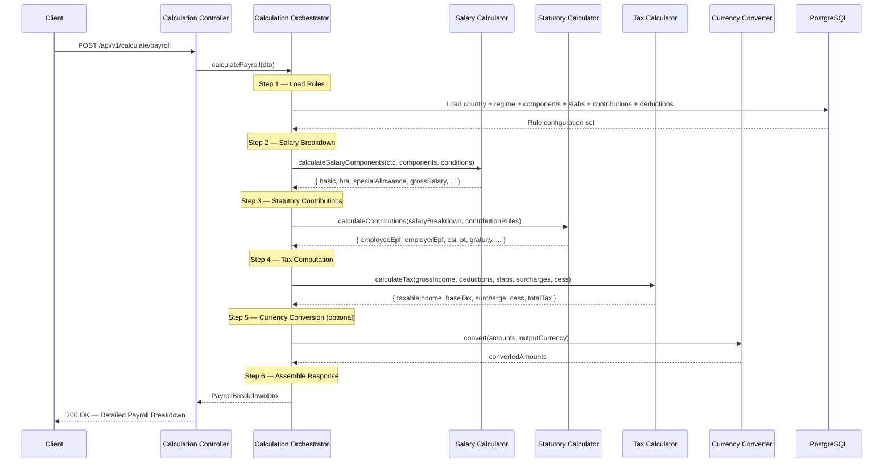

# Payroll Tax Engine — Architecture Design Document

> **Version**: 1.0.0  
> **Status**: Accepted  
> **Date**: 2026-06-16  
> **Stack**: NestJS · PostgreSQL · TypeScript  

---

## 1. System Overview

A **stateless, multi-country Payroll Tax Calculation Engine** that accepts an employee's Annual CTC, country code, and tax regime — then returns a detailed payroll breakdown including salary components, employee deductions, employer contributions, tax computation, net salary, and total employer cost.

### 1.1 Core Characteristics

| Property | Decision |
|----------|----------|
| **Type** | Stateless calculation service (no employee persistence) |
| **Scale** | Medium — 1K–50K employees, multi-tenant SaaS |
| **Tenancy** | Shared country rules — no per-tenant customization (MVP) |
| **Countries** | Multi-country architecture, India seed only |
| **Tax Regimes** | User-selectable (e.g., India Old/New regime) |
| **Period** | Annual CTC breakdown with monthly view |
| **Auth** | None — external auth provider assumed |
| **DB Purpose** | Configuration store only (rules, slabs, components) |
| **Currency** | Native currency per country; static exchange rate constants |

### 1.2 What This System Does NOT Do (Non-Goals)

- Employee data storage or payroll run history
- Per-tenant rule customization
- Authentication / Authorization
- Payslip PDF generation
- Batch/bulk payroll processing
- Retroactive recalculation
- Frontend / Admin UI

---

## 2. Architecture Pattern

### 2.1 Decision: Modular Monolith with Domain Model

```
┌─────────────────────────────────────────────────────────────┐
│                    NestJS Application                        │
│                                                             │
│  ┌──────────┐ ┌──────────┐ ┌──────────┐ ┌───────────────┐  │
│  │ Country  │ │Tax Regime│ │ Salary   │ │  Statutory    │  │
│  │ Module   │ │ Module   │ │Component │ │ Contribution  │  │
│  │          │ │          │ │ Module   │ │   Module      │  │
│  └────┬─────┘ └────┬─────┘ └────┬─────┘ └──────┬────────┘  │
│       │            │            │               │           │
│  ┌────┴─────┐ ┌────┴─────┐ ┌───┴──────┐ ┌──────┴────────┐  │
│  │Tax Slab  │ │Deduction │ │ Currency │ │  Calculation  │  │
│  │ Module   │ │ Section  │ │ Module   │ │    Module     │  │
│  │          │ │ Module   │ │          │ │  (Engine)     │  │
│  └──────────┘ └──────────┘ └──────────┘ └───────────────┘  │
│                                                             │
│  ┌─────────────────────────────────────────────────────────┐│
│  │                    Common Module                        ││
│  │  Constants · Enums · DTOs · Filters · Interceptors      ││
│  └─────────────────────────────────────────────────────────┘│
│                                                             │
│  ┌─────────────────────────────────────────────────────────┐│
│  │                   Database Module                       ││
│  │  TypeORM · Migrations · Seeds                           ││
│  └─────────────────────────────────────────────────────────┘│
└─────────────────────────────────────────────────────────────┘
```

### 2.2 Rationale

| Criterion | Assessment |
|-----------|-----------|
| Business rules complexity | **HIGH** — tax rules vary by country, regime, thresholds → Domain Model |
| Data access complexity | **MEDIUM** — structured rule queries → Repository Pattern via TypeORM |
| Independent scaling | **NO** — single service → Modular Monolith |
| Real-time requirements | **NO** — synchronous REST |

---

## 3. Project Structure

```
src/
├── main.ts
├── app.module.ts
├── config/
│   ├── app.config.ts
│   ├── database.config.ts
│   └── validation.schema.ts
├── common/
│   ├── constants/
│   │   └── exchange-rates.constant.ts
│   ├── enums/
│   │   ├── component-type.enum.ts        # EARNING | DEDUCTION | EMPLOYER_CONTRIBUTION
│   │   ├── calculation-type.enum.ts      # PERCENTAGE | FIXED | BALANCING
│   │   ├── contribution-side.enum.ts     # EMPLOYEE | EMPLOYER | BOTH
│   │   └── condition-operator.enum.ts    # EQ | LT | LTE | GT | GTE
│   ├── dto/
│   │   ├── api-response.dto.ts
│   │   └── pagination.dto.ts
│   ├── filters/
│   │   └── http-exception.filter.ts
│   ├── interceptors/
│   │   └── response-transform.interceptor.ts
│   └── interfaces/
│       └── base-entity.interface.ts
├── database/
│   ├── database.module.ts
│   ├── migrations/
│   └── seeds/
│       ├── seed.module.ts
│       ├── seed.service.ts
│       └── data/
│           └── india/
│               ├── country.seed.ts
│               ├── tax-regimes.seed.ts
│               ├── salary-components.seed.ts
│               ├── tax-slabs.seed.ts
│               ├── statutory-contributions.seed.ts
│               └── deduction-sections.seed.ts
└── modules/
    ├── country/
    │   ├── country.module.ts
    │   ├── country.controller.ts
    │   ├── country.service.ts
    │   ├── entities/
    │   │   └── country.entity.ts
    │   └── dto/
    │       ├── create-country.dto.ts
    │       └── update-country.dto.ts
    ├── tax-regime/
    │   ├── tax-regime.module.ts
    │   ├── tax-regime.controller.ts
    │   ├── tax-regime.service.ts
    │   ├── entities/
    │   │   └── tax-regime.entity.ts
    │   └── dto/
    ├── salary-component/
    │   ├── salary-component.module.ts
    │   ├── salary-component.controller.ts
    │   ├── salary-component.service.ts
    │   ├── entities/
    │   │   ├── salary-component.entity.ts
    │   │   └── component-condition.entity.ts
    │   └── dto/
    ├── tax-slab/
    │   ├── tax-slab.module.ts
    │   ├── tax-slab.controller.ts
    │   ├── tax-slab.service.ts
    │   ├── entities/
    │   │   ├── tax-slab.entity.ts
    │   │   ├── tax-surcharge.entity.ts
    │   │   └── tax-cess.entity.ts
    │   └── dto/
    ├── statutory-contribution/
    │   ├── statutory-contribution.module.ts
    │   ├── statutory-contribution.controller.ts
    │   ├── statutory-contribution.service.ts
    │   ├── entities/
    │   │   └── statutory-contribution.entity.ts
    │   └── dto/
    ├── deduction-section/
    │   ├── deduction-section.module.ts
    │   ├── deduction-section.controller.ts
    │   ├── deduction-section.service.ts
    │   ├── entities/
    │   │   └── deduction-section.entity.ts
    │   └── dto/
    ├── calculation/
    │   ├── calculation.module.ts
    │   ├── calculation.controller.ts
    │   ├── services/
    │   │   ├── calculation-orchestrator.service.ts
    │   │   ├── salary-calculator.service.ts
    │   │   ├── tax-calculator.service.ts
    │   │   ├── statutory-calculator.service.ts
    │   │   └── currency-converter.service.ts
    │   └── dto/
    │       ├── calculate-payroll.dto.ts
    │       └── payroll-breakdown.dto.ts
    └── currency/
        ├── currency.module.ts
        └── currency.service.ts
```

---

## 4. Calculation Engine — Data Flow



### 4.1 Calculation Order (Dependency Chain)

```
CTC (input)
  │
  ├──► BASIC = X% of CTC
  │      │
  │      ├──► HRA = Y% of BASIC (conditional: metro/non-metro)
  │      ├──► Employee EPF = 12% of BASIC (wage ceiling: ₹15,000/month)
  │      ├──► Employer EPF = 12% of BASIC (wage ceiling: ₹15,000/month)
  │      └──► Gratuity = 4.81% of BASIC
  │
  ├──► GROSS SALARY = CTC - Employer Contributions (EPF + ESI + Gratuity)
  │      │
  │      ├──► Employee ESI = 0.75% of GROSS (threshold: GROSS ≤ ₹21,000/month)
  │      ├──► Employer ESI = 3.25% of GROSS (threshold: GROSS ≤ ₹21,000/month)
  │      └──► Professional Tax = state-based fixed (≈ ₹200/month)
  │
  ├──► SPECIAL ALLOWANCE = GROSS - BASIC - HRA (balancing figure)
  │
  ├──► TAXABLE INCOME = GROSS - Standard Deduction - Claimed Deductions
  │      │
  │      └──► INCOME TAX = Progressive slab calculation + Surcharge + Cess
  │
  ├──► NET SALARY = GROSS - Employee EPF - Employee ESI - PT - Income Tax
  │
  └──► TOTAL EMPLOYER COST = CTC (already includes employer contributions)
```

Components are resolved by `display_order` (topological priority). The `calculation_base` field on each component references which resolved value to use as base.

---

## 5. Rule Versioning Strategy

All rule entities carry **effective dating**:

```
effective_from  DATE     NOT NULL    -- Rule becomes active
effective_to    DATE     NULL        -- NULL = currently active
is_active       BOOLEAN  DEFAULT true
```

**Query pattern** for calculation date `D`:

```sql
WHERE effective_from <= D
  AND (effective_to IS NULL OR effective_to >= D)
  AND is_active = true
```

**New financial year flow:**
1. Insert new rule rows with updated `effective_from`
2. Set `effective_to` on old rows to previous day
3. Old and new rules coexist — date-driven selection

No schema changes needed for annual compliance updates.

---

## 6. Currency Strategy

### MVP: Static Constants File

```typescript
// src/common/constants/exchange-rates.constant.ts
export const EXCHANGE_RATES: Record<string, Record<string, number>> = {
  USD: { INR: 83.50, GBP: 0.79, EUR: 0.92 },
  INR: { USD: 0.012, GBP: 0.0095, EUR: 0.011 },
  // ...
};

export const BASE_CURRENCY = 'USD';
```

### Future: Pluggable Exchange Rate Provider

```typescript
// Interface defined now, implementation swappable later
export interface ExchangeRateProvider {
  getRate(from: string, to: string, date?: Date): Promise<number>;
}
```

MVP uses `StaticExchangeRateProvider`. Later, swap to `ApiExchangeRateProvider` (e.g., Open Exchange Rates API) with zero engine changes.

---

## 7. Error Handling Strategy

| Scenario | HTTP Status | Error Code |
|----------|-------------|------------|
| Invalid/missing request fields | `400` | `VALIDATION_ERROR` |
| Unknown country code | `404` | `COUNTRY_NOT_FOUND` |
| Invalid tax regime for country | `400` | `INVALID_TAX_REGIME` |
| CTC ≤ 0 or non-numeric | `400` | `INVALID_CTC` |
| No active rules for country + date | `422` | `NO_ACTIVE_RULES` |
| Unsupported output currency | `400` | `UNSUPPORTED_CURRENCY` |
| Duplicate entity (admin CRUD) | `409` | `DUPLICATE_ENTRY` |
| Entity not found (admin CRUD) | `404` | `ENTITY_NOT_FOUND` |
| Internal server error | `500` | `INTERNAL_ERROR` |

**Standard error response shape:**

```json
{
  "success": false,
  "error": {
    "code": "COUNTRY_NOT_FOUND",
    "message": "Country with code 'XX' not found",
    "details": []
  },
  "timestamp": "2026-06-16T14:00:00.000Z"
}
```

---

## 8. Architecture Decision Records (ADRs)

### ADR-001: Modular Monolith over Microservices

| | |
|---|---|
| **Status** | Accepted |
| **Context** | System serves single domain (payroll calc). Team size small. No independent scaling need. |
| **Decision** | Modular Monolith with NestJS modules as bounded contexts |
| **Rationale** | Single deployment unit. Shared DB. Lower operational overhead. Clear module boundaries allow future extraction if needed. |
| **Trade-offs** | Cannot scale modules independently. Acceptable at medium scale. |
| **Revisit Trigger** | When individual modules need independent scaling or separate teams own different modules. |

### ADR-002: Generic Calculation Engine over Strategy Pattern

| | |
|---|---|
| **Status** | Accepted |
| **Context** | Country-specific tax rules vary, but all follow pattern: components → contributions → deductions → slabs → tax. |
| **Decision** | Single generic engine that reads all rules from DB config. No per-country strategy classes in MVP. |
| **Rationale** | All India rules (HRA conditions, EPF caps, ESI thresholds) are expressible via DB component conditions and thresholds. No country-specific code needed. YAGNI. |
| **Trade-offs** | If a country requires fundamentally different calculation flow, engine may need refactoring. Mitigated by keeping services single-responsibility. |
| **Revisit Trigger** | When onboarding a country whose calculation flow cannot be expressed via existing DB config model. |

### ADR-003: TypeORM over Prisma

| | |
|---|---|
| **Status** | Accepted |
| **Context** | Need PostgreSQL ORM with migration support, entity decorators, and repository pattern. |
| **Decision** | TypeORM — mature NestJS integration, decorator-based entities, built-in migration CLI. |
| **Rationale** | Native `@nestjs/typeorm` integration. Repository pattern out of the box. Effective dating queries straightforward with QueryBuilder. |
| **Trade-offs** | TypeORM has known quirks with complex relations. Acceptable for config-only schema. |
| **Revisit Trigger** | If query complexity outgrows TypeORM capabilities or performance degrades. |

### ADR-004: Effective Dating over Temporal Tables

| | |
|---|---|
| **Status** | Accepted |
| **Context** | Rule versioning needed for compliance updates across financial years. |
| **Decision** | `effective_from` / `effective_to` columns on every rule entity. |
| **Rationale** | Simple, explicit, portable. No PG extension dependency. Admin CRUD can manage versioned rows. Queries filter by date range. |
| **Trade-offs** | No automatic history tracking. Manual date management. Acceptable since rule changes are infrequent (annual). |
| **Revisit Trigger** | If audit requirements demand automatic history tracking or temporal queries. |

### ADR-005: Static Exchange Rate Constants over API

| | |
|---|---|
| **Status** | Accepted |
| **Context** | Multi-currency support needed. Exchange rates change frequently. |
| **Decision** | MVP uses static constants file. `ExchangeRateProvider` interface defined for future API integration. |
| **Rationale** | Avoids external API dependency in MVP. Interface segregation enables zero-code swap to live API later. |
| **Trade-offs** | Stale rates. Acceptable for MVP; conversion is informational, not transactional. |
| **Revisit Trigger** | When accuracy of exchange rates becomes business-critical. |

### ADR-006: Stateless API over Persistent Payroll Runs

| | |
|---|---|
| **Status** | Accepted |
| **Context** | Engine could persist employee data and payroll run results for audit. |
| **Decision** | Fully stateless. Each request self-contained. No employee or run persistence. |
| **Rationale** | Simplifies architecture. No employee PII management. Horizontal scaling trivial. Consumer stores results if needed. |
| **Trade-offs** | No server-side audit trail. No historical lookups. Consumer must manage result persistence. |
| **Revisit Trigger** | When audit/compliance requires server-side payroll run history. |

---

## 9. Decision Log (Chronological)

| # | Decision | Alternatives Considered | Reason |
|---|----------|------------------------|--------|
| 1 | Stateless calculation engine | Stateful with employee persistence; Hybrid | Simplicity, no PII, horizontal scaling |
| 2 | Shared country rules (no per-tenant customization) | Per-tenant overrides | YAGNI for MVP. All tenants use same country config |
| 3 | Multi-country design, India-only seed | India-only design; Multi-country + multi-seed | Validates extensibility without premature implementation |
| 4 | CRUD admin API (no auth) | DB seeds only; Admin UI | Programmatic rule management; auth is external |
| 5 | Both tax regimes, user-selectable | Single regime; Auto-comparison | Real-world India requirement; keeps scope tight |
| 6 | Annual CTC → monthly view | Monthly-only; Both modes | CTC is standard India input; monthly derived |
| 7 | Generic engine over Strategy pattern | Per-country strategy classes | All rules DB-configurable; YAGNI |
| 8 | TypeORM | Prisma, Drizzle | Best NestJS integration, repository pattern |
| 9 | Effective dating | PG temporal tables, event sourcing | Simple, explicit, no extension dependency |
| 10 | Static exchange rate file | Live API, DB-stored rates | No external dependency in MVP; interface ready for swap |

---

## 10. Assumptions

1. Currency conversion is **informational only** — all calculations happen in the country's native currency
2. EPF/ESI/PT/Gratuity thresholds follow India FY 2025–26 statutory rules
3. No payslip PDF generation in MVP
4. Single employee per calculation request (no batch)
5. Rule versioning = effective date-based; no retroactive recalculation
6. Exchange rates in the constants file are manually updated
7. Professional Tax uses a simplified flat rate; state-level variation deferred
8. Auth provider is external — all endpoints are unprotected

---

## 11. Validation Checklist

- [x] Requirements clearly understood
- [x] Constraints identified (stateless, NestJS, PG, no auth, India seed)
- [x] Each decision has trade-off analysis (6 ADRs)
- [x] Simpler alternatives considered (see Decision Log)
- [x] Team expertise matches chosen patterns (NestJS + TypeORM + REST)
- [x] ADRs written for all significant decisions
