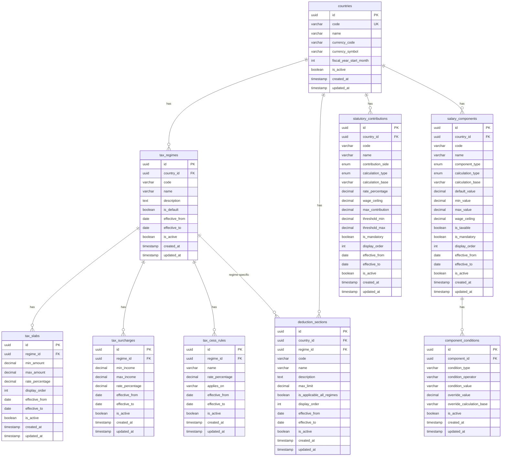

# Payroll Tax Engine — Database Schema Design

> **Version**: 1.0.0  
> **Date**: 2026-06-16  
> **Database**: PostgreSQL 15+  
> **ORM**: TypeORM  

---

## 1. Entity Relationship Diagram



---

## 2. Table Definitions

### 2.1 `countries`

Primary configuration entity. One row per supported country.

| Column | Type | Constraints | Description |
|--------|------|-------------|-------------|
| `id` | `UUID` | `PK, DEFAULT gen_random_uuid()` | Primary key |
| `code` | `VARCHAR(2)` | `NOT NULL, UNIQUE` | ISO 3166-1 alpha-2 (e.g., `IN`, `US`, `GB`) |
| `name` | `VARCHAR(100)` | `NOT NULL` | Full country name |
| `currency_code` | `VARCHAR(3)` | `NOT NULL` | ISO 4217 currency code (e.g., `INR`, `USD`) |
| `currency_symbol` | `VARCHAR(5)` | `NOT NULL` | Display symbol (e.g., `₹`, `$`) |
| `fiscal_year_start_month` | `SMALLINT` | `NOT NULL, CHECK(1-12)` | Month the fiscal year begins (India = `4` for April) |
| `is_active` | `BOOLEAN` | `NOT NULL, DEFAULT true` | Soft delete flag |
| `created_at` | `TIMESTAMPTZ` | `NOT NULL, DEFAULT NOW()` | Record creation |
| `updated_at` | `TIMESTAMPTZ` | `NOT NULL, DEFAULT NOW()` | Last modification |

**Indexes:**
- `UNIQUE INDEX idx_countries_code ON countries(code)`

---

### 2.2 `tax_regimes`

Tax regimes available per country. A country may have multiple regimes (e.g., India Old/New).

| Column | Type | Constraints | Description |
|--------|------|-------------|-------------|
| `id` | `UUID` | `PK` | Primary key |
| `country_id` | `UUID` | `FK → countries(id), NOT NULL` | Owning country |
| `code` | `VARCHAR(50)` | `NOT NULL` | Machine-readable code (e.g., `OLD_REGIME`, `NEW_REGIME`) |
| `name` | `VARCHAR(100)` | `NOT NULL` | Display name (e.g., "Old Tax Regime") |
| `description` | `TEXT` | | Human-readable description |
| `is_default` | `BOOLEAN` | `NOT NULL, DEFAULT false` | Default regime for this country |
| `effective_from` | `DATE` | `NOT NULL` | Start of validity |
| `effective_to` | `DATE` | | End of validity (`NULL` = currently active) |
| `is_active` | `BOOLEAN` | `NOT NULL, DEFAULT true` | Soft delete flag |
| `created_at` | `TIMESTAMPTZ` | `NOT NULL, DEFAULT NOW()` | |
| `updated_at` | `TIMESTAMPTZ` | `NOT NULL, DEFAULT NOW()` | |

**Indexes & Constraints:**
- `UNIQUE INDEX idx_tax_regimes_country_code_eff ON tax_regimes(country_id, code, effective_from)`
- `INDEX idx_tax_regimes_country ON tax_regimes(country_id)`
- Only one `is_default = true` per country (enforced via application logic)

---

### 2.3 `salary_components`

Configurable salary structure components per country. Each component defines how a piece of the salary is calculated.

| Column | Type | Constraints | Description |
|--------|------|-------------|-------------|
| `id` | `UUID` | `PK` | Primary key |
| `country_id` | `UUID` | `FK → countries(id), NOT NULL` | Owning country |
| `code` | `VARCHAR(50)` | `NOT NULL` | Machine-readable code (e.g., `BASIC`, `HRA`, `SPECIAL_ALLOWANCE`) |
| `name` | `VARCHAR(100)` | `NOT NULL` | Display name |
| `component_type` | `ENUM('EARNING','DEDUCTION','EMPLOYER_CONTRIBUTION')` | `NOT NULL` | Type classification |
| `calculation_type` | `ENUM('PERCENTAGE','FIXED','BALANCING')` | `NOT NULL` | How value is computed |
| `calculation_base` | `VARCHAR(50)` | | Base for percentage calc (e.g., `CTC`, `BASIC`, `GROSS`). `NULL` for FIXED/BALANCING. |
| `default_value` | `DECIMAL(12,4)` | | Percentage (e.g., `40.0000`) or fixed amount. `NULL` for BALANCING. |
| `min_value` | `DECIMAL(15,2)` | | Minimum allowed value (floor) |
| `max_value` | `DECIMAL(15,2)` | | Maximum allowed value (cap) |
| `wage_ceiling` | `DECIMAL(15,2)` | | Max base amount for calculation (e.g., ₹15,000 for EPF) |
| `is_taxable` | `BOOLEAN` | `NOT NULL, DEFAULT true` | Whether component is part of taxable income |
| `is_mandatory` | `BOOLEAN` | `NOT NULL, DEFAULT true` | Whether component is always included |
| `display_order` | `INT` | `NOT NULL` | Calculation priority (lower = computed first) |
| `effective_from` | `DATE` | `NOT NULL` | Start of validity |
| `effective_to` | `DATE` | | End of validity |
| `is_active` | `BOOLEAN` | `NOT NULL, DEFAULT true` | Soft delete flag |
| `created_at` | `TIMESTAMPTZ` | `NOT NULL, DEFAULT NOW()` | |
| `updated_at` | `TIMESTAMPTZ` | `NOT NULL, DEFAULT NOW()` | |

**Indexes & Constraints:**
- `UNIQUE INDEX idx_salary_comp_country_code_eff ON salary_components(country_id, code, effective_from)`
- `INDEX idx_salary_comp_country_active ON salary_components(country_id, is_active, effective_from)`

**`component_type` Values:**

| Value | Meaning | Example |
|-------|---------|---------|
| `EARNING` | Adds to gross salary | Basic, HRA, Special Allowance |
| `DEDUCTION` | Deducted from employee gross | (Reserved for future payroll deductions) |
| `EMPLOYER_CONTRIBUTION` | Employer cost above gross | Employer EPF, Employer ESI, Gratuity |

**`calculation_type` Values:**

| Value | Meaning | Example |
|-------|---------|---------|
| `PERCENTAGE` | `default_value`% of `calculation_base` | Basic = 40% of CTC |
| `FIXED` | Fixed `default_value` amount (annual) | PT = ₹2,400/year |
| `BALANCING` | Remainder after all other same-type components | Special Allowance = Gross - Basic - HRA |

---

### 2.4 `component_conditions`

Conditional overrides for salary components. Allows different values based on runtime parameters.

| Column | Type | Constraints | Description |
|--------|------|-------------|-------------|
| `id` | `UUID` | `PK` | Primary key |
| `component_id` | `UUID` | `FK → salary_components(id), NOT NULL` | Parent component |
| `condition_type` | `VARCHAR(50)` | `NOT NULL` | Condition category (e.g., `METRO`, `NON_METRO`, `GROSS_THRESHOLD`, `AGE_GT`) |
| `condition_operator` | `VARCHAR(5)` | `NOT NULL` | Comparison operator (`EQ`, `LT`, `LTE`, `GT`, `GTE`) |
| `condition_value` | `VARCHAR(100)` | `NOT NULL` | Value to compare against (stringified) |
| `override_value` | `DECIMAL(12,4)` | `NOT NULL` | Replacement for `default_value` when condition matches |
| `override_calculation_base` | `VARCHAR(50)` | | Override for `calculation_base` (if also changes) |
| `is_active` | `BOOLEAN` | `NOT NULL, DEFAULT true` | |
| `created_at` | `TIMESTAMPTZ` | `NOT NULL, DEFAULT NOW()` | |
| `updated_at` | `TIMESTAMPTZ` | `NOT NULL, DEFAULT NOW()` | |

**Indexes:**
- `INDEX idx_comp_conditions_component ON component_conditions(component_id, is_active)`

**Example Conditions (India):**

| Component | condition_type | condition_operator | condition_value | override_value | Description |
|-----------|---------------|-------------------|-----------------|---------------|-------------|
| HRA | `LOCATION` | `EQ` | `METRO` | `50.0000` | 50% of Basic for metro cities |
| HRA | `LOCATION` | `EQ` | `NON_METRO` | `40.0000` | 40% of Basic for non-metro |
| ESI_EMPLOYEE | `GROSS_MONTHLY` | `LTE` | `21000` | `0.7500` | ESI only if gross ≤ ₹21,000/month |
| ESI_EMPLOYER | `GROSS_MONTHLY` | `LTE` | `21000` | `3.2500` | Employer ESI threshold |

---

### 2.5 `tax_slabs`

Progressive income tax brackets per regime.

| Column | Type | Constraints | Description |
|--------|------|-------------|-------------|
| `id` | `UUID` | `PK` | Primary key |
| `regime_id` | `UUID` | `FK → tax_regimes(id), NOT NULL` | Owning tax regime |
| `min_amount` | `DECIMAL(15,2)` | `NOT NULL` | Slab lower bound (inclusive) |
| `max_amount` | `DECIMAL(15,2)` | | Slab upper bound (inclusive). `NULL` = no upper limit (top slab). |
| `rate_percentage` | `DECIMAL(5,2)` | `NOT NULL` | Tax rate for this slab |
| `display_order` | `INT` | `NOT NULL` | Slab order (ascending) |
| `effective_from` | `DATE` | `NOT NULL` | |
| `effective_to` | `DATE` | | |
| `is_active` | `BOOLEAN` | `NOT NULL, DEFAULT true` | |
| `created_at` | `TIMESTAMPTZ` | `NOT NULL, DEFAULT NOW()` | |
| `updated_at` | `TIMESTAMPTZ` | `NOT NULL, DEFAULT NOW()` | |

**Indexes:**
- `INDEX idx_tax_slabs_regime_eff ON tax_slabs(regime_id, effective_from, is_active)`

**Example — India New Regime (FY 2025–26):**

| display_order | min_amount | max_amount | rate_percentage |
|---------------|-----------|------------|----------------|
| 1 | 0.00 | 400000.00 | 0.00 |
| 2 | 400001.00 | 800000.00 | 5.00 |
| 3 | 800001.00 | 1200000.00 | 10.00 |
| 4 | 1200001.00 | 1600000.00 | 15.00 |
| 5 | 1600001.00 | 2000000.00 | 20.00 |
| 6 | 2000001.00 | 2400000.00 | 25.00 |
| 7 | 2400001.00 | `NULL` | 30.00 |

---

### 2.6 `tax_surcharges`

Surcharge rules applied on top of base tax when income exceeds thresholds.

| Column | Type | Constraints | Description |
|--------|------|-------------|-------------|
| `id` | `UUID` | `PK` | Primary key |
| `regime_id` | `UUID` | `FK → tax_regimes(id), NOT NULL` | Owning tax regime |
| `min_income` | `DECIMAL(15,2)` | `NOT NULL` | Income lower bound (inclusive) |
| `max_income` | `DECIMAL(15,2)` | | Income upper bound. `NULL` = no limit. |
| `rate_percentage` | `DECIMAL(5,2)` | `NOT NULL` | Surcharge rate |
| `effective_from` | `DATE` | `NOT NULL` | |
| `effective_to` | `DATE` | | |
| `is_active` | `BOOLEAN` | `NOT NULL, DEFAULT true` | |
| `created_at` | `TIMESTAMPTZ` | `NOT NULL, DEFAULT NOW()` | |
| `updated_at` | `TIMESTAMPTZ` | `NOT NULL, DEFAULT NOW()` | |

**Indexes:**
- `INDEX idx_tax_surcharges_regime ON tax_surcharges(regime_id, effective_from, is_active)`

**Example — India:**

| min_income | max_income | rate_percentage |
|-----------|------------|----------------|
| 5000000.00 | 10000000.00 | 10.00 |
| 10000001.00 | 20000000.00 | 15.00 |
| 20000001.00 | 50000000.00 | 25.00 |
| 50000001.00 | `NULL` | 37.00 |

---

### 2.7 `tax_cess_rules`

Cess applied on (Tax + Surcharge). Configurable per regime.

| Column | Type | Constraints | Description |
|--------|------|-------------|-------------|
| `id` | `UUID` | `PK` | Primary key |
| `regime_id` | `UUID` | `FK → tax_regimes(id), NOT NULL` | Owning tax regime |
| `name` | `VARCHAR(100)` | `NOT NULL` | E.g., "Health & Education Cess" |
| `rate_percentage` | `DECIMAL(5,2)` | `NOT NULL` | Cess rate (e.g., `4.00`) |
| `applies_on` | `VARCHAR(50)` | `NOT NULL` | What it applies on (e.g., `TAX_PLUS_SURCHARGE`) |
| `effective_from` | `DATE` | `NOT NULL` | |
| `effective_to` | `DATE` | | |
| `is_active` | `BOOLEAN` | `NOT NULL, DEFAULT true` | |
| `created_at` | `TIMESTAMPTZ` | `NOT NULL, DEFAULT NOW()` | |
| `updated_at` | `TIMESTAMPTZ` | `NOT NULL, DEFAULT NOW()` | |

**Indexes:**
- `INDEX idx_tax_cess_regime ON tax_cess_rules(regime_id, effective_from, is_active)`

---

### 2.8 `statutory_contributions`

Mandatory statutory contributions per country. Covers both employer and employee sides.

| Column | Type | Constraints | Description |
|--------|------|-------------|-------------|
| `id` | `UUID` | `PK` | Primary key |
| `country_id` | `UUID` | `FK → countries(id), NOT NULL` | Owning country |
| `code` | `VARCHAR(50)` | `NOT NULL` | Machine code (e.g., `EPF_EMPLOYEE`, `EPF_EMPLOYER`, `ESI_EMPLOYEE`) |
| `name` | `VARCHAR(100)` | `NOT NULL` | Display name |
| `contribution_side` | `ENUM('EMPLOYEE','EMPLOYER')` | `NOT NULL` | Who pays |
| `calculation_type` | `ENUM('PERCENTAGE','FIXED')` | `NOT NULL` | How value is computed |
| `calculation_base` | `VARCHAR(50)` | | Base for percentage (e.g., `BASIC`, `GROSS`) |
| `rate_percentage` | `DECIMAL(5,4)` | | Rate (e.g., `12.0000` for 12%) |
| `wage_ceiling` | `DECIMAL(15,2)` | | Max base for calculation (e.g., ₹15,000 for EPF) |
| `max_contribution` | `DECIMAL(15,2)` | | Maximum contribution amount |
| `threshold_min` | `DECIMAL(15,2)` | | Minimum eligibility threshold |
| `threshold_max` | `DECIMAL(15,2)` | | Maximum eligibility threshold (e.g., Gross ≤ ₹21,000 for ESI) |
| `is_mandatory` | `BOOLEAN` | `NOT NULL, DEFAULT true` | |
| `display_order` | `INT` | `NOT NULL` | |
| `effective_from` | `DATE` | `NOT NULL` | |
| `effective_to` | `DATE` | | |
| `is_active` | `BOOLEAN` | `NOT NULL, DEFAULT true` | |
| `created_at` | `TIMESTAMPTZ` | `NOT NULL, DEFAULT NOW()` | |
| `updated_at` | `TIMESTAMPTZ` | `NOT NULL, DEFAULT NOW()` | |

**Indexes & Constraints:**
- `UNIQUE INDEX idx_stat_contrib_country_code_eff ON statutory_contributions(country_id, code, effective_from)`
- `INDEX idx_stat_contrib_country_active ON statutory_contributions(country_id, is_active, effective_from)`

**Example — India:**

| code | contribution_side | rate_percentage | calculation_base | wage_ceiling | threshold_max |
|------|------------------|----------------|-----------------|-------------|--------------|
| `EPF_EMPLOYEE` | EMPLOYEE | 12.0000 | BASIC | 15000.00 | `NULL` |
| `EPF_EMPLOYER` | EMPLOYER | 12.0000 | BASIC | 15000.00 | `NULL` |
| `ESI_EMPLOYEE` | EMPLOYEE | 0.7500 | GROSS | `NULL` | 21000.00 |
| `ESI_EMPLOYER` | EMPLOYER | 3.2500 | GROSS | `NULL` | 21000.00 |
| `PT_EMPLOYEE` | EMPLOYEE | `NULL` (fixed) | `NULL` | `NULL` | `NULL` |
| `GRATUITY_EMPLOYER` | EMPLOYER | 4.8100 | BASIC | `NULL` | `NULL` |

> **Note**: For PT (Professional Tax), `calculation_type = 'FIXED'` with `rate_percentage = NULL`. The fixed amount is stored as seed data or handled via a separate fixed-amount field. The annual PT is typically ₹2,400 (₹200/month).

---

### 2.9 `deduction_sections`

Tax deductions and exemptions. Can be regime-specific or apply to all regimes.

| Column | Type | Constraints | Description |
|--------|------|-------------|-------------|
| `id` | `UUID` | `PK` | Primary key |
| `country_id` | `UUID` | `FK → countries(id), NOT NULL` | Owning country |
| `regime_id` | `UUID` | `FK → tax_regimes(id)` | If regime-specific. `NULL` = applies to all regimes. |
| `code` | `VARCHAR(50)` | `NOT NULL` | Section code (e.g., `SECTION_80C`, `STANDARD_DEDUCTION`) |
| `name` | `VARCHAR(100)` | `NOT NULL` | Display name |
| `description` | `TEXT` | | Human-readable explanation |
| `max_limit` | `DECIMAL(15,2)` | | Maximum deduction allowed. `NULL` = no limit. |
| `is_applicable_all_regimes` | `BOOLEAN` | `NOT NULL, DEFAULT false` | `true` if applies regardless of regime |
| `display_order` | `INT` | `NOT NULL` | |
| `effective_from` | `DATE` | `NOT NULL` | |
| `effective_to` | `DATE` | | |
| `is_active` | `BOOLEAN` | `NOT NULL, DEFAULT true` | |
| `created_at` | `TIMESTAMPTZ` | `NOT NULL, DEFAULT NOW()` | |
| `updated_at` | `TIMESTAMPTZ` | `NOT NULL, DEFAULT NOW()` | |

**Indexes & Constraints:**
- `UNIQUE INDEX idx_deduction_country_code_eff ON deduction_sections(country_id, code, effective_from)`
- `INDEX idx_deduction_country_regime ON deduction_sections(country_id, regime_id, is_active)`

**Example — India:**

| code | regime_id | max_limit | is_applicable_all_regimes | Description |
|------|-----------|-----------|--------------------------|-------------|
| `STANDARD_DEDUCTION` | `NULL` | 75000.00 | `true` | Standard deduction for salaried (New: ₹75K, Old: ₹50K — versioned by date) |
| `SECTION_80C` | (Old Regime ID) | 150000.00 | `false` | Investments, PPF, ELSS, LIC, etc. |
| `SECTION_80D` | (Old Regime ID) | 25000.00 | `false` | Health insurance premium |
| `SECTION_80CCD_1B` | (Old Regime ID) | 50000.00 | `false` | NPS additional deduction |
| `HRA_EXEMPTION` | (Old Regime ID) | `NULL` | `false` | HRA tax exemption (complex calc) |

---

## 3. Common Patterns

### 3.1 Effective Dating Filter

Every query against rule tables includes:

```sql
WHERE effective_from <= :effective_date
  AND (effective_to IS NULL OR effective_to >= :effective_date)
  AND is_active = true
```

### 3.2 Composite Unique Constraints

Prevent duplicate rule versions:

```sql
UNIQUE (country_id, code, effective_from)  -- salary_components, statutory_contributions
UNIQUE (country_id, code, effective_from)  -- deduction_sections
UNIQUE (country_id, code, effective_from)  -- tax_regimes
```

### 3.3 Audit Columns

Every table has:
- `created_at TIMESTAMPTZ DEFAULT NOW()`
- `updated_at TIMESTAMPTZ DEFAULT NOW()` (auto-updated via TypeORM `@UpdateDateColumn`)

### 3.4 Soft Deletes

All rule entities use `is_active BOOLEAN DEFAULT true`. No hard deletes on configuration data.

---

## 4. Index Strategy

| Table | Index | Columns | Purpose |
|-------|-------|---------|---------|
| `countries` | `idx_countries_code` | `(code)` UNIQUE | Country lookup by ISO code |
| `tax_regimes` | `idx_tax_regimes_country_code_eff` | `(country_id, code, effective_from)` UNIQUE | Regime lookup + duplicate prevention |
| `tax_regimes` | `idx_tax_regimes_country` | `(country_id)` | List regimes by country |
| `salary_components` | `idx_salary_comp_country_code_eff` | `(country_id, code, effective_from)` UNIQUE | Component lookup + duplicate prevention |
| `salary_components` | `idx_salary_comp_country_active` | `(country_id, is_active, effective_from)` | Active components for calculation |
| `component_conditions` | `idx_comp_conditions_component` | `(component_id, is_active)` | Conditions for a component |
| `tax_slabs` | `idx_tax_slabs_regime_eff` | `(regime_id, effective_from, is_active)` | Slabs for calculation |
| `tax_surcharges` | `idx_tax_surcharges_regime` | `(regime_id, effective_from, is_active)` | Surcharges for calculation |
| `tax_cess_rules` | `idx_tax_cess_regime` | `(regime_id, effective_from, is_active)` | Cess for calculation |
| `statutory_contributions` | `idx_stat_contrib_country_code_eff` | `(country_id, code, effective_from)` UNIQUE | Contribution lookup |
| `statutory_contributions` | `idx_stat_contrib_country_active` | `(country_id, is_active, effective_from)` | Active contributions for calculation |
| `deduction_sections` | `idx_deduction_country_code_eff` | `(country_id, code, effective_from)` UNIQUE | Deduction lookup |
| `deduction_sections` | `idx_deduction_country_regime` | `(country_id, regime_id, is_active)` | Deductions by regime |

---

## 5. Migration Strategy

- TypeORM migrations for all schema changes
- Seed scripts for India initial data (FY 2025–26)
- Seeds are idempotent — safe to re-run
- Migration naming: `{timestamp}-{description}.ts` (e.g., `1718540000000-create-countries-table.ts`)
